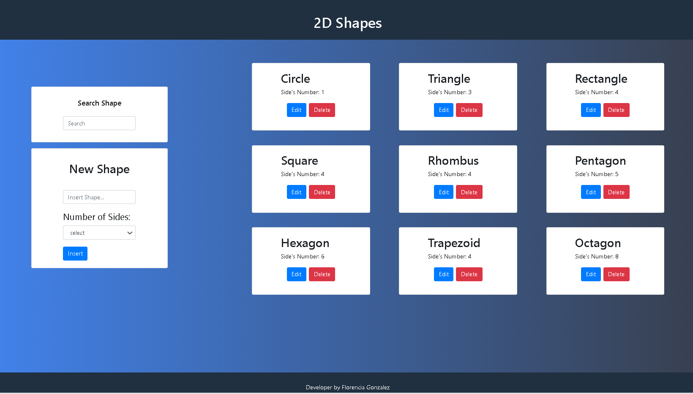

# Figuras Geometricas

La siguiente App permite insertar, eliminar y editar figuras geomericas 2D. Además de hacer una búsqueda por nombre de la figura

## Stack Utilizado

React js, HTML, CSS, Boostrap

## Available Scripts

In the project directory, you can run:
### `npm install`
### `npm start`

Runs the app in the development mode.\
Open [http://localhost:3000](http://localhost:3000) to view it in the browser.

The page will reload if you make edits.\
You will also see any lint errors in the console.

